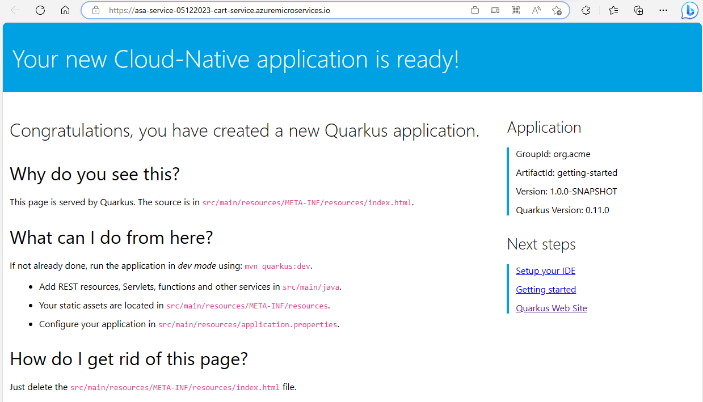

# Deploy and run a simple Quarkus app on Azure Spring Apps

This quick start shows you the instructions about deploying a fat-jar built from a simple Quarkus app to different tiers of Azure Spring Apps (ASA).

## Prepare the sample app

The [quarkus-quickstarts/getting-started](https://github.com/quarkusio/quarkus-quickstarts/tree/main/getting-started) is used as the sample in this article. 

```
git clone https://github.com/quarkusio/quarkus-quickstarts.git
cd quarkus-quickstarts/getting-started
```

## Deploy to ASA Enterprise tier

First, build a fat-jar from the sample app.

```
mvn clean install -Dquarkus.package.type=uber-jar
```

The relative path of generated fat-jar is `target/getting-started-1.0.0-SNAPSHOT-runner.jar`.

### Provision an Enterprise tier ASA instance 

Follow instructions from [Quickstart: Build and deploy apps to Azure Spring Apps using the Enterprise tier - Provision a service instance](https://learn.microsoft.com/en-us/azure/spring-apps/quickstart-deploy-apps-enterprise?tabs=azure-portal#provision-a-service-instance) to provision an Enterprise tier ASA instance, but just create one application for this article. Here're commands I copied and executed: 

```
az extension add --upgrade --name spring
az extension remove --name spring-cloud

az provider register --namespace Microsoft.SaaS
az term accept \
    --publisher vmware-inc \
    --product azure-spring-cloud-vmware-tanzu-2 \
    --plan asa-ent-hr-mtr

RESOURCE_GROUP_NAME=asa-enterprise-`date +%F`
az group create \
    --name ${RESOURCE_GROUP_NAME} \
    --location eastus

SERVICE_INSTANCE_NAME=asa-enterprise-service-`date +%F`
az spring create \
    --resource-group ${RESOURCE_GROUP_NAME} \
    --name ${SERVICE_INSTANCE_NAME} \
    --sku Enterprise \
    --enable-application-configuration-service \
    --enable-service-registry \
    --enable-gateway \
    --enable-api-portal

WORKSPACE_NAME=log-analytis-workspace-`date +%F`
az monitor log-analytics workspace create \
    --resource-group ${RESOURCE_GROUP_NAME} \
    --workspace-name ${WORKSPACE_NAME} \
    --location eastus

LOG_ANALYTICS_RESOURCE_ID=$(az monitor log-analytics workspace show \
    --resource-group ${RESOURCE_GROUP_NAME} \
    --workspace-name ${WORKSPACE_NAME} \
    --query id \
    --output tsv)

AZURE_SPRING_APPS_RESOURCE_ID=$(az spring show \
    --resource-group ${RESOURCE_GROUP_NAME} \
    --name ${SERVICE_INSTANCE_NAME} \
    --query id \
    --output tsv)

az monitor diagnostic-settings create \
    --name "send-logs-and-metrics-to-log-analytics" \
    --resource ${AZURE_SPRING_APPS_RESOURCE_ID} \
    --workspace ${LOG_ANALYTICS_RESOURCE_ID} \
    --logs '[
         {
           "category": "ApplicationConsole",
           "enabled": true,
           "retentionPolicy": {
             "enabled": false,
             "days": 0
           }
         },
         {
            "category": "SystemLogs",
            "enabled": true,
            "retentionPolicy": {
              "enabled": false,
              "days": 0
            }
          },
         {
            "category": "IngressLogs",
            "enabled": true,
            "retentionPolicy": {
              "enabled": false,
              "days": 0
             }
           }
       ]' \
       --metrics '[
         {
           "category": "AllMetrics",
           "enabled": true,
           "retentionPolicy": {
             "enabled": false,
             "days": 0
           }
         }
       ]'

APP_NAME=quarkus-getting-started
az spring app create \
    --resource-group ${RESOURCE_GROUP_NAME} \
    --service ${SERVICE_INSTANCE_NAME} \
    --name ${APP_NAME} \
    --assign-endpoint true
```

### Deploy the fat-jar to the Enterprise tier ASA instance 

When the app is running, run the following commands to deploy the fat-jar to the Enterprise tier ASA instance.

```
PATH_TO_FAT_JAR=target/getting-started-1.0.0-SNAPSHOT-runner.jar
az spring app deploy \
    --resource-group ${RESOURCE_GROUP_NAME} \
    --service ${SERVICE_INSTANCE_NAME} \
    --name ${APP_NAME} \
    --artifact-path ${PATH_TO_FAT_JAR} \
    --verbose
```

When the deployment completes, you can retrieve the url.

```
az spring app show \
    --resource-group ${RESOURCE_GROUP_NAME} \
    --service ${SERVICE_INSTANCE_NAME} \
    --name ${APP_NAME} \
    --query properties.url -o tsv
```

Copy the output (e.g., `https://asa-enterprise-service-05122023-quarkus-getting-started.azuremicroservices.io`) and open it in your browser, you should see the similar home page.



You can try the other two REST APIs exposed by the sample app:

* REST API `/hello`, e.g.:
  
  ```
  curl https://asa-enterprise-service-05122023-quarkus-getting-started.azuremicroservices.io/hello
  ```

  You should see `hello` is returned.

* REST API `/hello/greeting/{name}`, e.g.:

  ```
  curl https://asa-enterprise-service-05122023-quarkus-getting-started.azuremicroservices.io/hello/greeting/quarkus
  ```

  You should see `hello quarkus` is returned.

### Clear up the resources

Run the following command to clear up the resources once they're no longer needed.

```
az group delete \
    --name ${RESOURCE_GROUP_NAME} \
    --yes --no-wait
```

## Deploy to ASA Standard/Basic tier

Because the port that liveness / readiness probes of the Standard/Basic tier ASA will detect is `1025`, you need to configure it in the sample project.

```
# Make sure you're located in 'quarkus-quickstarts/getting-started'
echo "quarkus.http.port=1025" >> src/main/resources/application.properties
```

Then build a fat-jar from the sample app.

```
mvn clean install -Dquarkus.package.type=uber-jar
```

The relative path of generated fat-jar is `target/getting-started-1.0.0-SNAPSHOT-runner.jar`.

### Provision a Standard/Basic tier ASA instance 

Follow instructions from [How to Deploy Spring Boot applications from Azure CLI](https://learn.microsoft.com/en-us/azure/spring-apps/how-to-launch-from-source) to provision a Standard or Basic tier ASA instance. Here're commands I copied and executed: 

* For Standard tier

  ```
  RESOURCE_GROUP_NAME=asa-standard-`date +%F`
  SERVICE_INSTANCE_NAME=asa-standard-service-`date +%F`
  APP_NAME=quarkus-getting-started

  az extension add --upgrade --name spring
  az group create --location eastus --name ${RESOURCE_GROUP_NAME}

  az spring create \
    --resource-group ${RESOURCE_GROUP_NAME} \
    --name ${SERVICE_INSTANCE_NAME} \
    --sku Standard
 
  az spring app create \
    --resource-group ${RESOURCE_GROUP_NAME} \
    --service ${SERVICE_INSTANCE_NAME} \
    --name ${APP_NAME} \
    --assign-endpoint true
  ``` 

* For Basic tier:

  ```
  RESOURCE_GROUP_NAME=asa-basic-`date +%F`
  SERVICE_INSTANCE_NAME=asa-basic-service-`date +%F`
  APP_NAME=quarkus-getting-started

  az extension add --upgrade --name spring
  az group create --location eastus --name ${RESOURCE_GROUP_NAME}
 
  az group create --location eastus --name ${RESOURCE_GROUP_NAME}
  az spring create \
    --resource-group ${RESOURCE_GROUP_NAME} \
    --name ${SERVICE_INSTANCE_NAME} \
    --sku Basic
 
  az spring app create \
    --resource-group ${RESOURCE_GROUP_NAME} \
    --service ${SERVICE_INSTANCE_NAME} \
    --name ${APP_NAME} \
    --assign-endpoint true
  ```

### Deploy the fat-jar to the Standard/Basic tier ASA instance 

When the app is running, run the following commands to deploy the fat-jar to the Standard/Basic tier ASA instance.

```
PATH_TO_FAT_JAR=target/getting-started-1.0.0-SNAPSHOT-runner.jar
az spring app deploy \
    --resource-group ${RESOURCE_GROUP_NAME} \
    --service ${SERVICE_INSTANCE_NAME} \
    --name ${APP_NAME} \
    --artifact-path ${PATH_TO_FAT_JAR} \
    --verbose
```

When the deployment completes, you can retrieve the url.

```
az spring app show \
    --resource-group ${RESOURCE_GROUP_NAME} \
    --service ${SERVICE_INSTANCE_NAME} \
    --name ${APP_NAME} \
    --query properties.url -o tsv
```

Copy the output (e.g., `https://asa-standard-service-05122023-quarkus-getting-started.azuremicroservices.io`) and open it in your browser. However, the expected home page is not displayed. Instead, you will see `Internal Server Error`.

Run the command below to retrieve the log:

```
az spring app logs -f \
    --resource-group ${RESOURCE_GROUP_NAME} \
    --service ${SERVICE_INSTANCE_NAME} \
    --name ${APP_NAME}
```

You will see the similar output:

```
May 12, 2023 8:39:22 AM io.quarkus.vertx.http.runtime.QuarkusErrorHandler handle
ERROR: HTTP Request to / failed, error id: 413f56bf-19eb-4935-bc86-7704e9facaf7-5
java.lang.StringIndexOutOfBoundsException: begin 5, end 3, length 67
        at java.base/java.lang.String.checkBoundsBeginEnd(String.java:3319)
        at java.base/java.lang.String.substring(String.java:1874)
        at io.vertx.core.file.impl.FileResolverImpl.unpackFromJarURL(FileResolverImpl.java:291)
        at io.vertx.core.file.impl.FileResolverImpl.unpackUrlResource(FileResolverImpl.java:239)
        at io.vertx.core.file.impl.FileResolverImpl.resolveFile(FileResolverImpl.java:162)
        at io.vertx.core.impl.VertxImpl.resolveFile(VertxImpl.java:829)
        at io.vertx.core.file.impl.FileSystemImpl$20.perform(FileSystemImpl.java:1135)
        at io.vertx.core.file.impl.FileSystemImpl$20.perform(FileSystemImpl.java:1133)
        at io.vertx.core.file.impl.FileSystemImpl$BlockingAction.handle(FileSystemImpl.java:1174)
        at io.vertx.core.file.impl.FileSystemImpl$BlockingAction.handle(FileSystemImpl.java:1156)
        at io.vertx.core.impl.ContextBase.lambda$null$0(ContextBase.java:137)
        at io.vertx.core.impl.ContextInternal.dispatch(ContextInternal.java:264)
        at io.vertx.core.impl.ContextBase.lambda$executeBlocking$1(ContextBase.java:135)
        at io.vertx.core.impl.TaskQueue.run(TaskQueue.java:76)
        at org.jboss.threads.ContextHandler$1.runWith(ContextHandler.java:18)
        at org.jboss.threads.EnhancedQueueExecutor$Task.run(EnhancedQueueExecutor.java:2513)
        at org.jboss.threads.EnhancedQueueExecutor$ThreadBody.run(EnhancedQueueExecutor.java:1538)
        at org.jboss.threads.DelegatingRunnable.run(DelegatingRunnable.java:29)
        at org.jboss.threads.ThreadLocalResettingRunnable.run(ThreadLocalResettingRunnable.java:29)
        at io.netty.util.concurrent.FastThreadLocalRunnable.run(FastThreadLocalRunnable.java:30)
        at java.base/java.lang.Thread.run(Thread.java:829)
```

Since the same issue doesn't happen for the Enterprise tier, there must be something different between Enterprise and Standard / Basic tier, which may be worth to be investigated further.  

Fortunately, you can try the other two REST APIs exposed by the sample app which are working as expected:

* REST API `/hello`, e.g.:
  
  ```
  curl https://asa-standard-service-05122023-quarkus-getting-started.azuremicroservices.io/hello
  ```

  You should see `hello` is returned.

* REST API `/hello/greeting/{name}`, e.g.:

  ```
  curl https://asa-standard-service-05122023-quarkus-getting-started.azuremicroservices.io/hello/greeting/quarkus
  ```

  You should see `hello quarkus` is returned.

### Clear up the resources

Run the following command to clear up the resources once they're no longer needed.

```
az group delete \
    --name ${RESOURCE_GROUP_NAME} \
    --yes --no-wait
```
