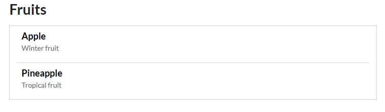

# Communication between microservices in Azure Spring Apps and Azure Container Apps

In this tutorial, you deploy two microservices, one is a back-end application running in Azure Spring Apps (ASA), the other is a front-end application running in Azure Container Apps (ACA) which makes a direct service call to the API exposed by the back-end application.

## Deploy the back-end application in Azure Spring Apps

This section shows you the instructions about deploying a microservice to the ASA Standard consumption and dedicated plan.

### Prepare the back-end application

The [fruits-api](https://github.com/majguo/java-on-azure-samples/tree/main/quarkus/fruits-api) is used as the back-end application in this section. 

```
git clone https://github.com/majguo/java-on-azure-samples.git
```

Build a fat-jar from the sample app:

```
cd java-on-azure-samples/quarkus/fruits-api
mvn clean package -Dquarkus.package.type=uber-jar
```

The relative path of generated fat-jar is `target/fruits-api-1.0.0-SNAPSHOT-runner.jar`.

Run the sample app locally:

```
java -jar target/fruits-api-1.0.0-SNAPSHOT-runner.jar
```

Open `http://localhost:8080/fruits` in your browser, you should see fruits returned in `JSON` format:

```
[
    {
        "name": "Apple",
        "description": "Winter fruit"
    },
    {
        "name": "Pineapple",
        "description": "Tropical fruit"
    }
]
```

Press `Ctrl + C` to stop the sample once you complete the try and test.

### Provision an ASA Standard consumption and dedicated plan service instance

Follow instructions from [Quickstart: Provision an Azure Spring Apps Standard consumption and dedicated plan service instance](https://learn.microsoft.com/azure/spring-apps/quickstart-provision-standard-consumption-service-instance?tabs=Azure-CLI) to provision an ASA Standard consumption and dedicated plan service instance . Here're commands I copied and executed: 

```
az extension add --upgrade --name containerapp
az provider register --namespace Microsoft.App
az provider register --namespace Microsoft.OperationalInsights

az extension add --upgrade --name spring
az provider register --namespace Microsoft.AppPlatform

RESOURCE_GROUP=asa-consumption-`date +%F`
LOCATION=eastus
AZURE_CONTAINER_APPS_ENVIRONMENT=`date +%F`
AZURE_SPRING_APPS_INSTANCE=asa-consumption-svc-`date +%F`
APP_NAME=fruits-api

az group create \
  --name $RESOURCE_GROUP \
  --location $LOCATION

az containerapp env create \
  --resource-group $RESOURCE_GROUP \
  --name $AZURE_CONTAINER_APPS_ENVIRONMENT \
  --location $LOCATION \
  --enable-workload-profiles

az containerapp env workload-profile set \
  --resource-group $RESOURCE_GROUP \
  --name $AZURE_CONTAINER_APPS_ENVIRONMENT \
  --workload-profile-name my-wlp \
  --workload-profile-type D4 \
  --min-nodes 1 \
  --max-nodes 2

MANAGED_ENV_RESOURCE_ID=$(az containerapp env show \
  --resource-group $RESOURCE_GROUP \
  --name $AZURE_CONTAINER_APPS_ENVIRONMENT \
  --query id \
  --output tsv)

az spring create \
  --resource-group $RESOURCE_GROUP \
  --name $AZURE_SPRING_APPS_INSTANCE \
  --managed-environment $MANAGED_ENV_RESOURCE_ID \
  --sku StandardGen2 \
  --location $LOCATION
  ```

### Deploy the fat-jar to the ASA Standard consumption and dedicated plan service instance

When the ASA Standard consumption and dedicated plan service instance is up, run the following commands to create an ASA app and then deploy the fat-jar.

```
az spring app create \
  --resource-group $RESOURCE_GROUP \
  --service $AZURE_SPRING_APPS_INSTANCE \
  --name $APP_NAME \
  --workload-profile my-wlp \
  --assign-endpoint true

PATH_TO_FAT_JAR=target/fruits-api-1.0.0-SNAPSHOT-runner.jar
az spring app deploy \
  --resource-group $RESOURCE_GROUP \
  --service $AZURE_SPRING_APPS_INSTANCE \
  --name $APP_NAME \
  --artifact-path ${PATH_TO_FAT_JAR} \
  --verbose
```

When the deployment completes, you can retrieve the url and output the `fruits` API endpoint.

```
url=$(az spring app show \
    --resource-group $RESOURCE_GROUP \
    --service $AZURE_SPRING_APPS_INSTANCE \
    --name $APP_NAME \
    --query properties.url -o tsv)
echo ${url}/fruits
```

Copy the endpoint and open it in your browser, you should see fruits returned in `JSON` format as before:

```
[
    {
        "name": "Apple",
        "description": "Winter fruit"
    },
    {
        "name": "Pineapple",
        "description": "Tropical fruit"
    }
]
```

Switch to the root directory where the repo is located:

```
cd ../../..
```

## Deploy the front-end application in Azure Container Apps

This section shows you the instructions about deploying a microservice to the Azure Container Apps which makes a direct service call to the API deployed in the Azure Spring Apps before.

### Prepare the front-end application

The [fruits-ui](https://github.com/majguo/java-on-azure-samples/tree/main/quarkus/fruits-ui) is used as the front-end application in this section. 

You shuold have already cloned the repo in the previous section. If not, run the following command to clone the repo:

 
```
git clone https://github.com/majguo/java-on-azure-samples.git
```

Build a Docker image from the sample app:

```
cd java-on-azure-samples/quarkus/fruits-ui/src
docker build -t fruits-ui .
```

Check if the container works as expected by running it locally:

```
docker run -it --rm -p 3000:3000 -e API_BASE_URL=$url fruits-ui
```

By adding the argument `-e API_BASE_URL=$url` to `docker run`, you define an environment variable for your Docker container. With this syntax, the environment variable named `API_BASE_URL` is set to the url of your back-end application.

Open `http://localhost:3000` in your browser, you should see the similar page as below.



Press `Ctrl + C` to stop the sample once you complete the try and test.

Now push the image to a public repository in Docker Hub which can be deployed to the ACA environment later.
Remember to replace placeholder `<DockerHub-account>` with a valid Docker Hub account before running the following commands.

```
DOCKER_HUB_ACCOUNT=<DockerHub-account>
docker tag fruits-ui ${DOCKER_HUB_ACCOUNT}/fruits-ui
docker login
docker push ${DOCKER_HUB_ACCOUNT}/fruits-ui
```

### Deploy the image to the ACA environment

Create and deploy your container app with the following command.

```
ACA_NAME=fruits-ui
az containerapp create \
  --name $ACA_NAME \
  --resource-group $RESOURCE_GROUP \
  --environment $AZURE_CONTAINER_APPS_ENVIRONMENT \
  --image ${DOCKER_HUB_ACCOUNT}/fruits-ui  \
  --target-port 3000 \
  --env-vars API_BASE_URL=$url \
  --ingress 'external'
```

By adding the argument `--env-vars API_BASE_URL=$url` to `az containerapp create`, you define an environment variable for your front end application. With this syntax, the environment variable named `API_BASE_URL` is set to the url of your back-end application.

When the deployment completes, you can retrieve the url of the front-end application.

```
echo https://$(az containerapp show \
  --resource-group $RESOURCE_GROUP \
  --name $ACA_NAME \
  --query properties.configuration.ingress.fqdn -o tsv)
```

Copy the output and open it in your browser, you should see the similar page above.


## Clear up the resources

Run the following command to clear up the resources once they're no longer needed.

```
az group delete \
  --name $RESOURCE_GROUP \
  --yes --no-wait
```

## References

* [Introduction to Azure Spring Apps - Standard consumption and dedicated plan](https://learn.microsoft.com/azure/spring-apps/overview#standard-consumption-and-dedicated-plan)
  
* [Quickstart: Provision an Azure Spring Apps Standard consumption and dedicated plan service instance](https://learn.microsoft.com/azure/spring-apps/quickstart-provision-standard-consumption-service-instance?tabs=Azure-CLI)
* [Tutorial: Communication between microservices in Azure Container Apps](https://learn.microsoft.com/azure/container-apps/communicate-between-microservices?tabs=bash&pivots=docker-local)
